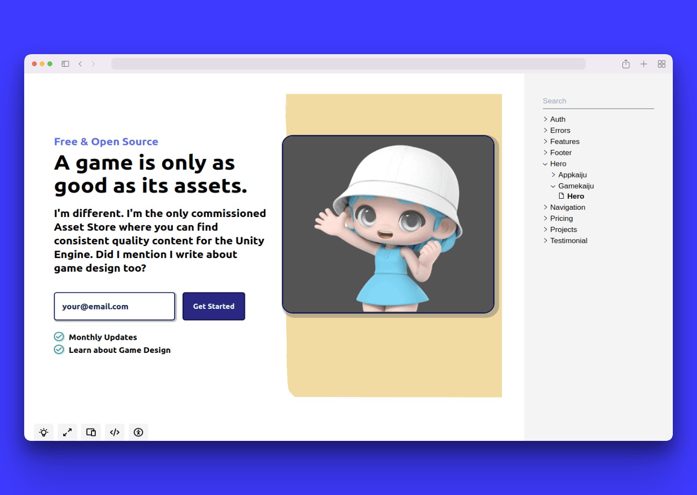
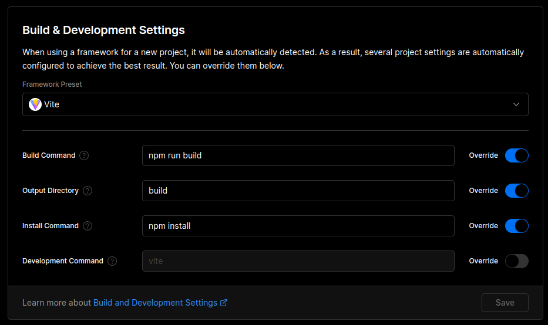

# Design System for Gamekaiju & Appkaiju

Using Tailwind and Ladle.



## How to develop?

```bash
# using pnpm is adviced
pnpm install

# start the development mode
pnpm dev

# if you want to check how the static site will look like
pnpm serve
```

## How to publish?

Project is configured to do a package publish on every commit to main. So, after the commits containing your work, but before pushing to main, on a working tree clean, do:

```bash
npm version <major|minor|patch>
git push --all origin
```

## How to consume?

If the project is configured to be private, source code will not be public. Nonetheless, you can consume it in another project as follows:

```bash
npm install @feremabraz/monster-designsystem
pnpm add @feremabraz/monster-designsystem
```

In that case, for it to work while consuming it, you will need a Personal Access Token (classic) with at least read:packages permissions.

```bash
//npm.pkg.github.com/:_authToken=TOKEN
@YOUR_ORGANIZATION:registry=https://npm.pkg.github.com
```

## How to deploy a static site?

Configure your Vercel deployment to use Vite and the same scripts that the package uses instead of the default ones, i.e. the following:


